# AStar算法实验报告

陈帆	16340017	2018.12.23

--------

## 摘要

以八数码问题为对象，使用A*算法来解决实际问题。

算法的步骤完全按照朱福喜版《人工智能基础教程》来实现，并采用了两种不同的估值函数：

- h<sub>1</sub>：放错位置的数字个数
- h<sub>2</sub>：所有放错位置与其正确位置的曼哈顿距离之和

完成的算法能够成功找出所有有解的八数码问题的移动路径(并且是最优解)，并通过比较算法结果，发现h<sub>2</sub>在面对复杂情况时搜索效率远远好于h<sub>1</sub>。

此外，还通过将空格视为0(九数码)，在使用相似的h<sub>1</sub>和h<sub>2</sub>时，比较了求解相同问题的搜索图是否相同。

得到的结论是，搜索图不是相同的。

## 导言

**八数码问题背景介绍**

在3×3的棋盘上，摆有八个棋子，每个棋子上标有1至8的某一数字。棋盘中留有一个空格，空格用0来表示。空格周围的棋子可以移到空格中。

要求解的问题是：给出一种初始布局（初始状态）和目标布局，找到一种最少步骤的移动方法，实现从初始布局到目标布局的转变。

本实验中我将使用A*算法求解八数码问题。

**A*算法背景介绍**

A* 算法在人工智能中是一种典型的启发式搜索算法，启发式搜索算法就是在状态空间中的搜索对每一个搜索的位置进行评估，得到最好的位置，再从这个位置进行搜索直到目标。其中，评估函数十分重要。A* 算法的评估函数定义为：

`f*(n) = g*(n) + h*(n)`

其中`f*(n)`定义为实际最小费用，`g*(n)`为S<sub>0</sub>到n的最小费用,`h*(n)`为n到S<sub>g</sub>的实际最小费用，`f(n)`、`g(n)`、`h(n)`分别表示这些费用的估计。本问题中`g(n) = g*(n)`。

A* 算法的特点(也是要求)是：`h(n) <= h*(n)`。

## 实验过程

#### 算法思想流程

A* 算法是从A算法约束而来的，而A算法又是从通用图搜索算法进行限制得来的，因此可以从通用图搜索算法改造得到A* 算法：

设S<sub>0</sub> 为初始状态，S<sub>g</sub>为目标状态：

1. open={ S<sub>0 </sub>}
2. closed={ }

3. 如果open={}，失败退出

4. 在open表上取出f(n)最小的结点n， n放到closed表中
5. 若n∈S<sub>g</sub>，则成功退出
6. 产生n的一切后继，将后继中不是n的先辈点的一切点构成集合M
7. 对M中的元素P，分别作两类处理：
   - 若P不属于G，则P对P进行估计加入open表，记入G和Tree
   - 若P∈G，则决定更改Tree中P到n的指针，并且更改P的子节点n的指针和费用
8. 转第3步

#### 程序主要流程

**代码结构**：

```
├── main.java    #主函数，通过图形界面来调用A*算法，并显示结果
├── AStar.java   #定义A*算法抽象类及其函数实现
└── Node.java    #定义A*算法搜索图的节点
```

**程序流程**

在`main.Java`中启动程序，点击按钮来启动A*算法求解八数码问题，图形化界面的实现过程就不在此赘述。

在`Node.java`中我抽象了搜索的状态(搜索图的节点)为一个类，八数码状态作为它的一个属性，此外还有父节点、前驱节点、后继节点等成员，评估值也是它的一个属性，方便之后的算法实现。

为了方便实现，我把一个八数码状态定义为了一个`String`。

在`AStar.java`中涵盖了A*算法的所有流程，包括评估函数、判断是否有解、产生所有后继、更新子节点指针及费用等，在`AStarSearch`函数定义了A *算法的完整过程，调用各种功能函数来实现A *算法。

评估函数有两种：

```java
//评估函数1，以放错位置的数字个数为估计
int evaluation1(String digital) {
    int eval = 0;
    //估计放错位置的数字个数
    for (int i = 0; i < 9; ++i) {
        if (digital.charAt(i) != end.charAt(i) && digital.charAt(i) != '0') eval++;
    }
    return eval;
}
```

```java
//评估函数2，以放错位置的数字移动到正确位置所需步数为估计
//方法为计算横、纵坐标之差的绝对值的和
int evaluation2(String digital) {
    int eval = 0;
    for (int i = 0; i < 9; ++i) {
        if (digital.charAt(i) != end.charAt(i) && digital.charAt(i) != '0') {
            for (int j = 0; j < 9; ++j) {
                if (digital.charAt(i) == end.charAt(j)) {
                    //x为横坐标，y为纵坐标
                    int x_i = i % 3, y_i = i / 3;
                    int x_j = j % 3, y_j = j / 3;
                    eval += Math.abs(x_i - x_j) + Math.abs(y_i - y_j);
                }
            }
        }
    }
    return eval;
}
```

产生后继的方法是寻找空格所在位置，找出所有的下一步移动可能性，并返回。

具体的`AStarSearch`函数流程是按照A* 算法来实现的：

- 首先判断是否有解
- 定义open表和close表，它们就组成了搜索图，并且由于节点存在父节点指针，也不需要额外定义搜索树了
- 生成初始状态
- 寻找open表中评估函数值最小的节点，产生后继，并对不是前驱节点的后继作两类处理
- 直到找到最终解或者open表为空，退出

```java
Stack<Node> AStarSearch(int select) {
    System.out.printf("初始八数码状态");
    print(start);
    //首先判断是否有解
    if (solvable(start) == false) {
        System.out.println("No Solution");
        return null;
    }
    //open表保存尚未考察过的节点
    //close表保存已经考察过的节点
    //搜索图由这两张表组成
    List<Node> open = new ArrayList<>();
    List<Node> close = new ArrayList<>();

    //生成初始状态
    Node S0 = new Node(start, null, new ArrayList<>(), new ArrayList<>(), 1, evaluation(select, start));
    open.add(S0);

    //存放成功的路径的栈
    Stack<Node> path;

    while (true) {
        //失败退出
        if (open.isEmpty()) {
            System.out.println("搜索失败");
            return null;
        }

        Collections.sort(open);
        //输出open表节点数、总扩展的节点数h和评估函数值最小的节点
        System.out.println("open表节点数: " + open.size());
        System.out.println("总扩展节点数: " + (open.size() + close.size()));

        //在open表上取f值最小的节点n
        //n放入close表，并从open表移除	        
        Node n = open.get(0);
        System.out.print("评估函数值最小的节点: ");
        print(n.digital);
        System.out.println("评估函数值: " + (n.depth + n.eval) + "\n");
        open.remove(0);
        close.add(n);

        //若n是目标状态，则成功退出
        if (n.digital.equals(end)) {
            System.out.println("\n搜索成功");
            //从n开始回溯得到路径
            path = getPath(n);
            break;
        }

        //产生n的一切后继
        List<String> successors = generateAllSuccessor(n.digital);
        //后继的前驱节点
        List<String> precursor = new ArrayList<>();
        for (String string : n.precursor) {
            precursor.add(string);
        }
        precursor.add(n.digital);
        for (int i = 0; i < successors.size(); ++i) {
            String successor = successors.get(i);
            //对不是n的前驱节点的后继进行操作
            if (n.isPrecursor(successor) == false) {
                boolean isInGraph = false;
                //在open表中寻找该后继
                for (int j = 0; j < open.size(); ++j) {
                    Node it = open.get(j);
                    //后继在open表中
                    if (it.digital.equals(successor)) {
                        //当前路径较好，修改后继的指针，使其指向n
                        if (n.depth + 1 < it.depth) {
                            //从后继原来父节点的后继列表中删去这个后继
                            for (Node iNode : it.parent.successor) {
                                if (iNode.digital.equals(successor)) {
                                    it.parent.successor.remove(iNode);
                                    break;
                                }
                            }       
                            //修改后继的父节点指针
                            it.parent = n;
                            it.depth = n.depth + 1;
                            it.precursor = precursor;
                        }
                        isInGraph = true;
                        break;
                    }
                }
                //在close表中寻找该后继
                for (int j = 0; j < close.size(); ++j) {
                    Node it = close.get(j);
                    //后继在close表中
                    if (it.digital.equals(successor)) {
                        //当前路径较好，修改后继的指针，使其指向n
                        if (n.depth + 1 < it.depth) {
                            //从后继原来父节点的后继列表中删去这个后继
                            for (Node iNode : it.parent.successor) {
                                if (iNode.digital.equals(successor)) {
                                    it.parent.successor.remove(iNode);
                                    break;
                                }
                            }
                            //修改后继的父节点指针
                            it.parent = n;
                            it.depth = n.depth + 1;
                            it.precursor = precursor;
                            //更改其子节点的指针及费用
                            update(it.successor, n.depth + 1);
                        }
                        isInGraph = true;
                        break;
                    }
                }
                //后继不在open表也不在close表
                if (isInGraph == false) {
                    Node child = new Node(successor, n, precursor, new ArrayList<>(), n.depth + 1, evaluation(select, successor));
                    n.successor.add(child);
                    open.add(child);
                    //验证启发函数的单调性
                    if (evaluation(select, successor) + 1 < evaluation(select, n.digital)) {
                        System.err.println("error h");
                        System.exit(1);
                    }
                }
            }
        }
    }

    //返回成功的路径
    return path;
}
```

**功能说明**

运行`main.java`，如图所示：

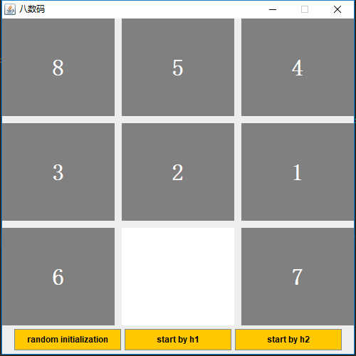

点击随机初始化按钮，可以随机生成初始状态

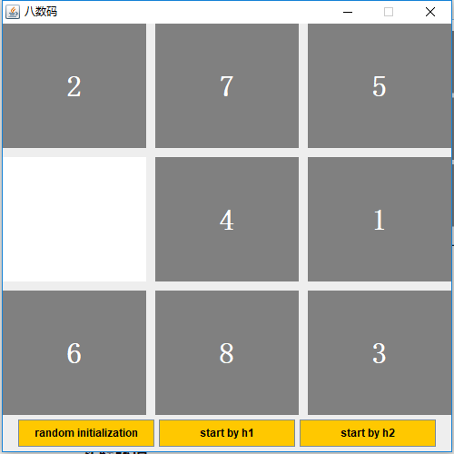

点击另外两个按钮，可以分别根据h<sub>1</sub>和h<sub>2</sub>启动A*算法：

- 初态无解时，弹出提示框

  

- 有解时，会自动开始A*算法查找最佳移动路径，并在终端提示框显示当前open表节点等信息。

  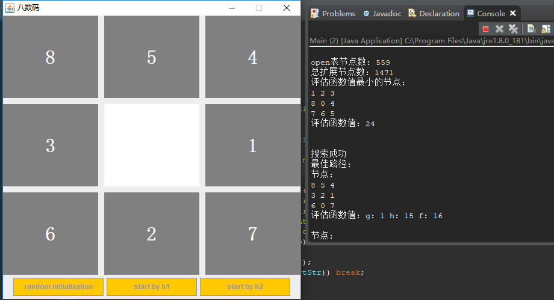

- 在搜索完成后 ，开始移动八数码。

  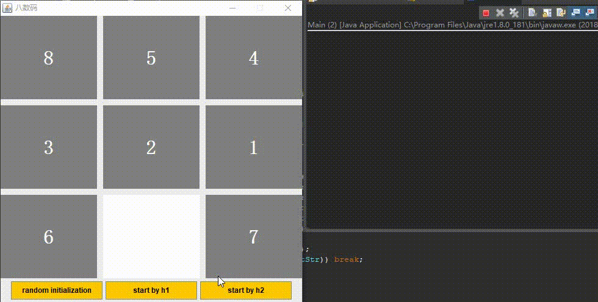

## 结果分析

#### 实验环境

> 编程语言：Java
>
> 运行环境：Windows
>
> IDE：Eclipse
>
> 直接运行Main.Java即可

#### 结果

**(1)利用A*算法求解八数码问题，在输出界面上动态显示OPEN表的结点数和评估函值最小的结点**

以**"283164705"**这个初态为例，对它使用A* 算法求解，输出过程如下：

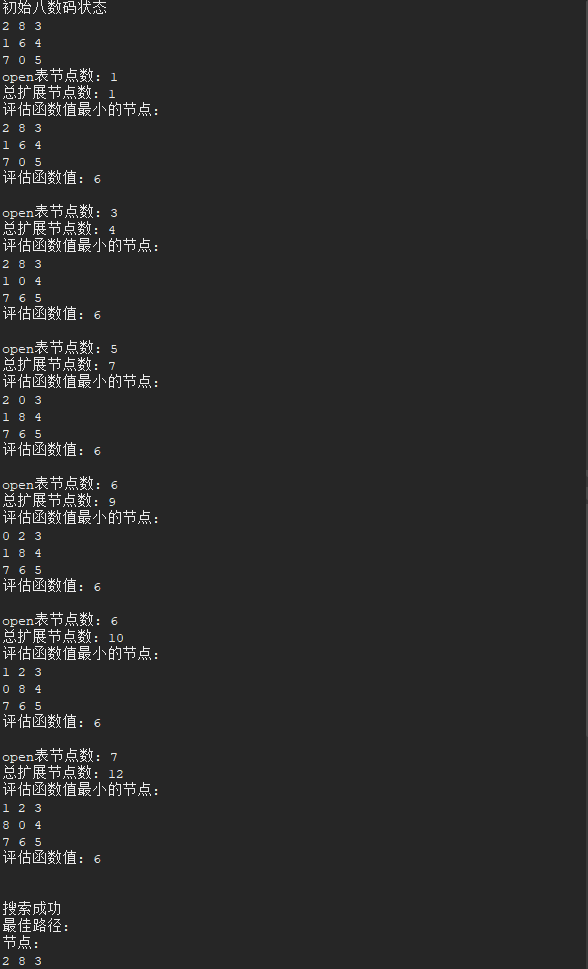

**(2)比较两种启发函数（上课和书上讲到的h1(n)和 h2(n)）的搜索效率，在输出界面上动态显示OPEN表的结点数、总扩展的结点数和评估函值最小的结点**

这两种启发函数在简单情况下搜索效率的差异不大，需要在复杂情况下才有说服力，比如对于**"854321607"**这个初态，两种方法的比较结果如下：

h<sub>1</sub>：

搜索过程：

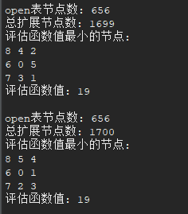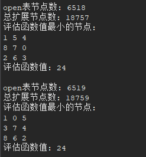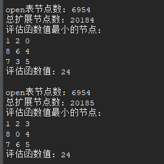

最佳路径的费用：

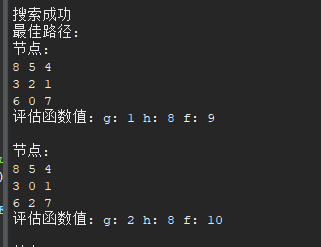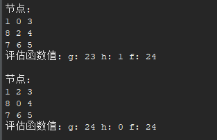

h<sub>2</sub>：

搜索过程：

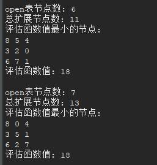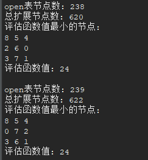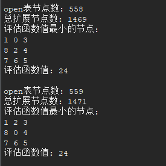

最佳路径的费用：

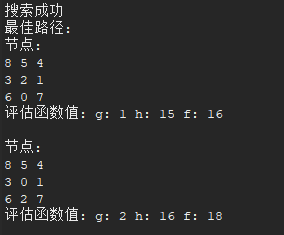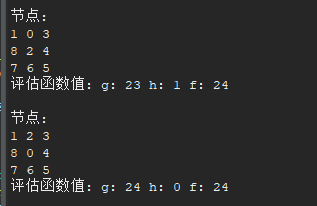

由于结果太长，没有完整贴出来，但我们还是可以明显看到，对于这同一种初态，h<sub>2</sub>只搜索了1000多个节点就找到了最优解，而h<sub>1</sub>则需要搜索20000多个节点，耗时接近h<sub>1</sub>的20倍。但它们找到的结果都是同样的，因此h<sub>2</sub>的搜索效率要明显优于h<sub>1</sub>。

**(3)输出OPEN表中在最佳路径上的结点及其评估函数值**

还是以**"283164705"**这个初态为例，输出结果如下：

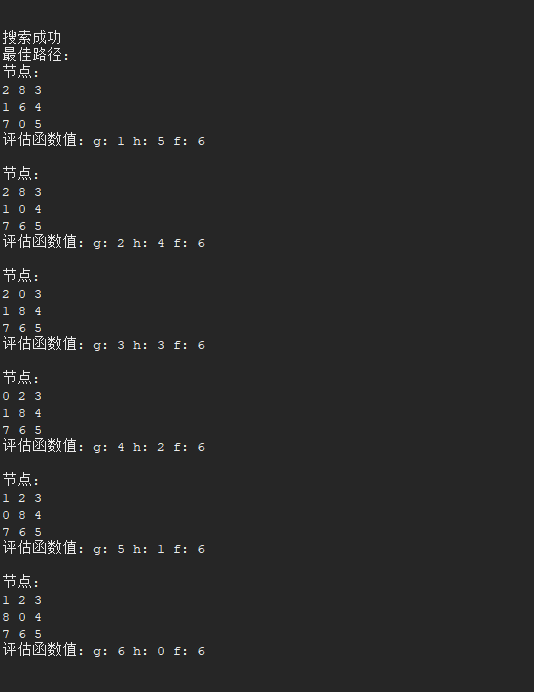

可以看到，最佳路径一共需要6次移动。

**(4)验证凡A* 算法挑选出来求后继的点n必定满足:f(n）≤ f*(S0)**

由于f*(S0)表示的是实际最小费用(移动次数)，这只有在求解完成后才能得知，因此无法在代码中检验，只能通过输出来进行判断：

以复杂情况**854321607** 为例，被挑选出求后继的点的评估值如下：

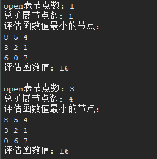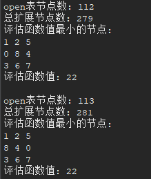

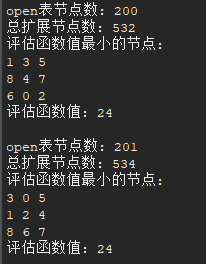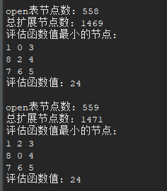

可以看到，一开始的评估函数值较小，但是会很快增大，增大到最大值后不再变化，评估函数值为24。

再来看看实际最小费用：

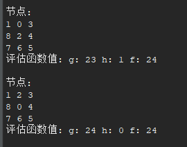

可以看到，实际最小费用为24，因此不等式是满足的。

**(5)验证h1(n)的单调性，显示凡A*算法挑选出来求后继的点ni扩展的一个子结点nj，检查是否满足: h(ni）≤1+h(nj)**

这个可以在代码中进行验证，在求出扩展的子节点时，对它的评估值进行判断是否满足不等式即可：

```java
//验证启发函数的单调性
if (evaluation(select, successor) + 1 < evaluation(select, n.digital)) {
    System.err.println("error h");
    System.exit(1);
}
```

而且从之前的输出来看，我们也能够发现子节点的启发函数值确实是满足这个不等式的。

**(6)如果将空格看作0，即九数码问题，利用相似的启发函数h1(n)和h2(n)，求解相同的问题的搜索图是否相同？**

以初态**"854321607"**为例，修改评估函数值，使用h<sub>1</sub>和h<sub>2</sub>的搜索过程如下：

h<sub>1</sub>：

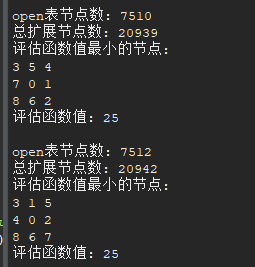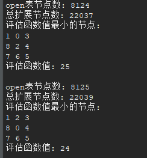

h<sub>2</sub>：

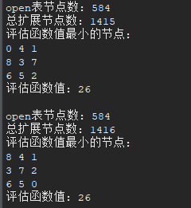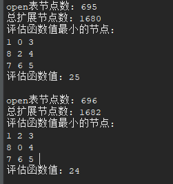

而之前八数码问题的搜索过程如下：

h<sub>1</sub>：

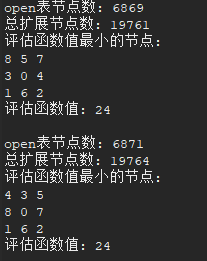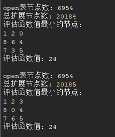

h<sub>2</sub>：

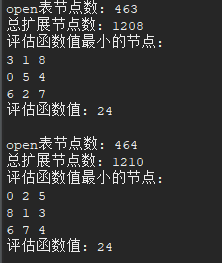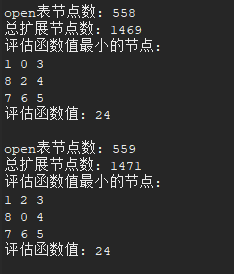


从结果可以看到，对于当前初态的九数码问题，使用两种启发函数的节点数都变多了，因此搜索图自然不会是相同的。

需要注意的是，由于九数码的评估函数考虑了"0"这个数字，因此它不再满足`h(n) <= h*(n)`，算法就不是A* 算法了，前面两个不等式自然就不会成立。

**(7)写出能否达到目标状态的判断方法**

对于八数码问题，可以直接根据初始状态来判断是否能够达到目标状态：

>  把一个八数码状态表示成一维的形式，求出除0之外所有数字的逆序数之和，也就是每个数字前面比它大的数字的个数的和，称为这个状态的逆序。
>
> 若两个状态的逆序奇偶性 相同，则可相互到达，否则不可相互到达

用Java实现的判断方法：

```java
boolean solvable(String digital) {
    int count1 = 0, count2 = 0;
    for (int i = 0; i < 9; ++i) {
        for (int j = 0; j < i; ++j) {
            if (digital.charAt(i) != '0' && digital.charAt(j) > digital.charAt(i)) 
                count1++;
            if (end.charAt(i) != '0' && end.charAt(j) > end.charAt(i))
                count2++;
        }
    }
    return (count1 % 2 == count2 % 2);
}
```


## 结论

A* 算法作为一种有效的启发式搜索算法，使用它来解决八数码问题效率还是很高的，但启发函数的选取会极大地影响它的搜索效率，如本实验中对比的两种启发函数，效率相差极大。

使用A* 算法，我们需要确保它的启发函数满足`h(n) <= h*(n)`，否则就不会是A* 算法，A* 算法的各种性质(比如有解时一定能找到最优解)就不会满足了。

## 参考文献

主要参考文献：

教材，即朱福喜版《人工智能基础教程》第二版