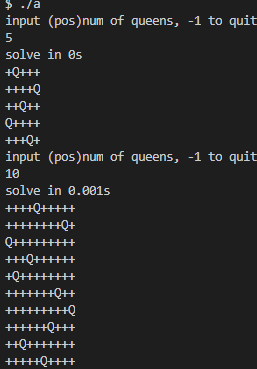
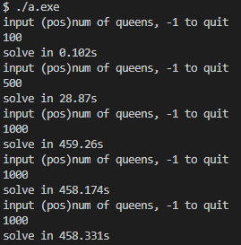
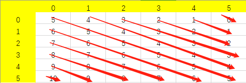
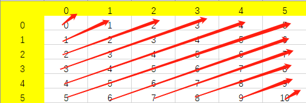
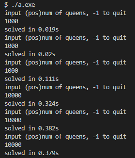
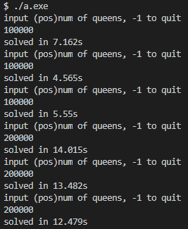
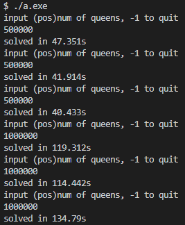
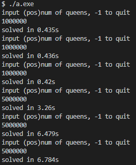
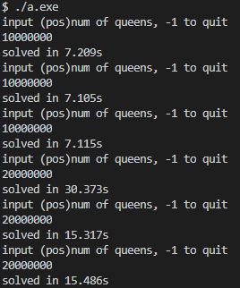

### 作业10

#### 题目

局部搜索解n皇后，并测试n的极限

#### 实验v0

v0版本我实现了最基本的局部搜索算法，该版本解$n=1000$需要超过$7$分钟，$n=10000$时间太长，超过极限。

<table style="width:100%; table-layout:fixed;text-align:center">
  <tr>
    <td></td>
    <td></td>
  </tr>
</table>


##### 状态的表示

首先，使用哪种数据结构表示n皇后问题的一个状态是很重要的，直接影响到算法的效率。我使用一个一维数组来表示状态，`i, board[i]`表示一个皇后的行、列位置。

初始时要随机生成一个状态，此时就可以解决掉所有行和列上的冲突，即保证每一行、每一列都只有一个皇后，那么这个过程就可以编码成随机生成一个元素值在`[0, n - 1]`的不重复的大小为$n$的数组。

##### 指标函数

n皇后问题的指标可以用皇后间的冲突数来表示，显然我们的目标是最小化冲突数到0，即找到n皇后的一个解。v0版本中我采用暴力的计算冲突数方法，即遍历所有的皇后对，判断它们是否在彼此的对角线上：

```cpp
int get_conflicts(int n) {
    int ans = 0;
    for (int i = 0; i < n - 1; ++i) {
        for (int j = i + 1; j < n; ++j) {
            if (j - i == abs(board[i] - board[j])) ans++;
        }
    }
    return ans;
}
```

该指标函数时间复杂度$O(n^2)$

##### 状态选择

通过交换两个皇后的列位置，可以得到当前状态的邻域P，我们按照贪心策略，从P中随机选取一个元素作为P'，那么P'的最优解就只有这个随机选取的元素。状态选择就变成了交换任意两个皇后的列位置，若交换后冲突数减少，则选择这个新状态。

##### 跳出局部最优

当所有交换都不会导致冲突数减少，即邻域P为空时，我们就进入了局部最优状态，但求解n皇后问题我们是得找到全局最优，解决方案是随机重启，即重新生成初始状态并计算冲突数。

##### 总体流程代码

```cpp
bool restart = true;
int curr;
while (true) {
    if (restart) {
        random_start(n);
        curr = get_conflicts(n);
    }
    if (curr == 0) break;
    restart = true;
    for (int i = 0; i < n - 1; ++i) {
        for (int j = i + 1; j < n; ++j) {
            swap(board[i], board[j]);
            int tmp = get_conflicts(n);
            if (tmp < curr) {
                curr = tmp;
                restart = false;
            }
            else swap(board[i], board[j]);
        }
    }
}
```

值得一提的是，表示状态的数组最好采用全局变量，这样不仅可以定义更大的数组，而且相比于在程序中`new`、`delete`数组，速度快很多倍。v0版本如果改成在程序中`new`数组，则解$n=1000$需要17分钟。

#### 实验v1

优化局部搜索算法主要有3种思路：

1. 引入选择概率
2. 改变步长
3. 多次生成初始解

v0版本中已经采用了思路3来帮助找到全局最优解。如果采用思路1的话，计算选择概率需要用到邻域内所有邻居的指标函数值，而邻域大小是$n(n - 1) / 2$，这导致选择过程会是$O(n^2)$的，因此基本上不采用这种优化思路。对于思路2，经过测试，改变步长为3（选取3个皇后参与交换）也不会改进算法效率，反而导致算法收敛更加不稳定，如果在运行过程中动态调整步长的话，何时调整也是需要探究的问题。总之，这两者都不是好的优化思路。

##### 冲突表

v0版本存在的一个明显的问题就是计算冲突数的方法，暴力的方法复杂度$O(n^2)$，每一次状态选择时都需要这样一个$O(n^2)$的过程是我们无法接受的。通过引入冲突表，我们只需要$O(1)$的时间就能够计算出新状态的冲突数。

我们知道冲突只会出现在对角线上，一个`n x n`的矩阵有多少条对角线呢？根据定义有主对角线（左上->右下）和反对角线（左下->右上），每种都有$2n - 1$条。将这些对角线按规则编号，$n=6$时的一个示例如图：

<table style="width:100%; table-layout:fixed;text-align:center">
  <tr>
  	<td>主对角线</td>
  	<td>反对角线</td>
  <tr>
    <td></td>
    <td></td>
  </tr>
</table>
因此，对于一个位置在`i, board[i]`（`board[i]`为列号）的皇后，她相应地也在编号为`i - board[i] + n - 1`的主对角线上，也在编号为`i + board[i]`的反对角线上。

这样，我们就可以把皇后的位置映射成对角线上的皇后个数，从而算出冲突数并放入冲突表中：

```cpp
int pos_diag[2 * MAX - 1]; // 主对角线上的皇后个数
int neg_diag[2 * MAX - 1]; // 反对角线上的皇后个数

int get_conflicts(int n) {
    int ans = 0;
    memset(pos_diag, 0, sizeof(int) * (2 * n - 1));
    memset(neg_diag, 0, sizeof(int) * (2 * n - 1));
    for (int i = 0; i < n; ++i) {
        pos_diag[i - board[i] + n - 1]++;
        neg_diag[i + board[i]]++;
    }
    for (int i = 0; i < 2 * n - 1; ++i) {
        ans += pos_diag[i] > 1 ? pos_diag[i] - 1 : 0;
        ans += neg_diag[i] > 1 ? neg_diag[i] - 1 : 0;
    }
    return ans;
}
```

注意，此时我们计算出的状态数跟v0版本的是不同的，如果一条对角线上有$n$个元素，那么此时的冲突数是$n-1$，但我们的优化目标都是冲突数为0，所以不影响。

##### 更新冲突表

状态选择时我们需要计算新状态的冲突数，`get_conflicts`函数此时复杂度为$O(n)$，似乎已得到了不错的优化，但通过维护冲突表，可以进一步把这个过程优化到$O(1)$。

交换位于`i, board[i]`和位于`j, board[j]`的两个皇后会对冲突数造成什么影响？

首先我们会把皇后从原始位置挪开，那么原始位置对应的对角线上的皇后个数自然减1，如果这些对角线上原本就有冲突，那么按照冲突数的定义，皇后个数减1会导致冲突减1；我们会把皇后挪到目标位置，那么目标位置对应的对角线上的皇后个数加1，如果这些对角线上原本就有皇后，那么冲突数自然也会加1。

```cpp
int swap_gain(int i, int j, int n) {
    int gain = 0;
    if (neg_diag[i + board[i]] > 1) gain--;
    if (neg_diag[j + board[j]] > 1) gain--;
    if (pos_diag[i - board[i] + n - 1] > 1) gain--;
    if (pos_diag[j - board[j] + n - 1] > 1) gain--;
    
    if (neg_diag[i + board[j]] > 0) gain++;
    if (neg_diag[j + board[i]] > 0) gain++;
    if (pos_diag[i - board[j] + n - 1] > 0) gain++;
    if (pos_diag[j - board[i] + n - 1] > 0) gain++;
    return gain;
}
```

当`gain < 0`时，说明新状态的冲突数更少。

选择新状态后，需要更新状态表以及交换皇后的列位置：

```cpp
void update_state(int i, int j, int n) {
    neg_diag[i + board[i]]--;
    neg_diag[j + board[j]]--;
    pos_diag[i - board[i] + n - 1]--;
    pos_diag[j - board[j] + n - 1]--;

    neg_diag[i + board[j]]++;
    neg_diag[j + board[i]]++;
    pos_diag[i - board[j] + n - 1]++;
    pos_diag[j - board[i] + n - 1]++;
    
    swap(board[i], board[j]);
}
```

##### 状态选择

在v0版本中还存在的一个问题就是新状态的选择，思路是随机选取两个皇后，但v0版本的实现却没有引入随机因素，而是按一定顺序选取的。这同样会极大地影响算法效率。经过测试，引入这个随机因素使得程序求解$n=100000$的时间从$120$秒显著降到了$6$秒左右。

##### 总体流程代码

```cpp
bool restart = true;
int curr;
clock_t start = clock();
while (true) {
    if (restart) {
        random_start(n);
        curr = get_conflicts(n);
    }
    if (curr == 0) break;
    restart = true;
    // 随机交换两个皇后,尝试次数不超过邻域大小
    long long max_iteration = (long long)n * (long long)n / 2;
    for (long long i = 0; i < max_iteration; ++i) {
        int i_index = get_randindex(n), j_index = get_randindex(n);
        int gain = swap_gain(i_index, j_index, n);
        if (gain < 0) {
            update_state(i_index, j_index, n);
            curr += gain;
            restart = false;
            break;
        }
    }
}
```

##### 实验结果

实验结果如下所示，v1版本很快解决了$n=1000$，解$n=10000$平均时间$0.36$秒，解$n=100000$平均时间$5.76$秒，解$n=200000$平均时间$13.33$秒，解$n=500000$平均时间$43.23$秒，解$n=1000000$平均时间约两分钟。

<table style="width:100%; table-layout:fixed;text-align:center">
  <tr>
    <td></td>
    <td></td>
    <td></td>
  </tr>
</table>


#### 实验v2

查阅相关文献，我发现在Rok Sosic发表的3,000,000 Queens in Less Than One Minute这篇论文中，他们提出了QS4算法，而我实现的v1版本实际上是QS1算法。相比于QS1算法，QS4算法对“随机初始化”这个过程进行了优化，最终速度要快上几百倍。

##### 随机初始化

Rok Sosic等人提出，完全随机的初始化会导致初始状态存在的冲突数约为$0.53n$，如果限制这个冲突数的大小为$c$，那么会极大地提升QS1算法的性能。

初始化的思想为：

1. 一行行选取皇后放置的列位置，以放置好的就不再移动
2. 先放置$n-c$个皇后，它们不应该产生冲突，因此需要为它们随机寻找空闲的列位置
3. 再放置$c$个皇后，此时可以完全随机放置

```cpp
int random_start_qs4(int n, int c) {
    int m = n - c;
    for (int i = 0; i < n; ++i) board[i] = i;
    memset(pos_diag, 0, sizeof(int) * (2 * n - 1));
    memset(neg_diag, 0, sizeof(int) * (2 * n - 1));
    
    for (int i = 0, last = n; i < m; ++i, --last) {
        int j = i + get_randindex(last);
        while (pos_diag[i - board[j] + n - 1] > 0 || neg_diag[i + board[j]] > 0) j = i + get_randindex(last);
        swap(board[i], board[j]);
        pos_diag[i - board[i] + n - 1]++;
        neg_diag[i + board[i]]++;
    }
    
    for (int i = m, last = c; i < n; ++i, --last) {
        int j = i + get_randindex(last);
        swap(board[i], board[j]);
        pos_diag[i - board[i] + n - 1]++;
        neg_diag[i + board[i]]++;
    }
}
```


##### 状态选择

状态选择的过程与QS1算法类似，只不过此时限定了第一个选取的皇后必须是会产生冲突的，第二个选取的皇后则可以完全随机选取，也可以按顺序选取。

##### 总体流程代码

```cpp
bool restart = true;
int curr;
int m = n - c;
while (true) {
    if (restart) curr = random_start_qs4(n, c);
    if (curr == 0) break;
    restart = true;
    int gain = 0;
    for (int i = m; i < n; ++i) {
        if (pos_diag[i - board[i] + n - 1] > 1 || neg_diag[i + board[i]] > 1) {
            for (int j = 0; j < n; ++j) {
                if (i != j) {
                    gain = swap_gain(i, j, n);
                    if (gain < 0) {
                        update_state(i, j, n);
                        curr += gain;
                        restart = false;
                        break;
                    }
                }
            }
            if (gain < 0) break;
        }
    }
}
```


##### 实验结果

最终结果如下图所示，解$n=1000000$仅需$0.4$秒，解$n=5000000$平均时间$5.5$秒，解$n=10000000$平均时间$9.84$秒，解$n=20000000$平均时间$20.392$秒，v2版本可以快速解决千万级别的n皇后问题。

<table style="width:100%; table-layout:fixed;text-align:center">
    <td></td>
    <td></td>
  </tr>
</table>

