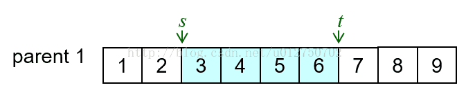
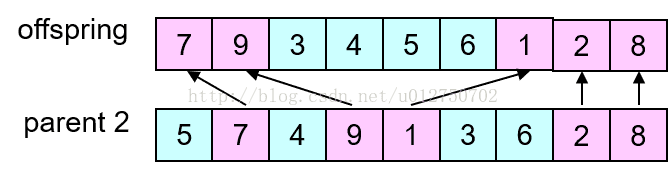
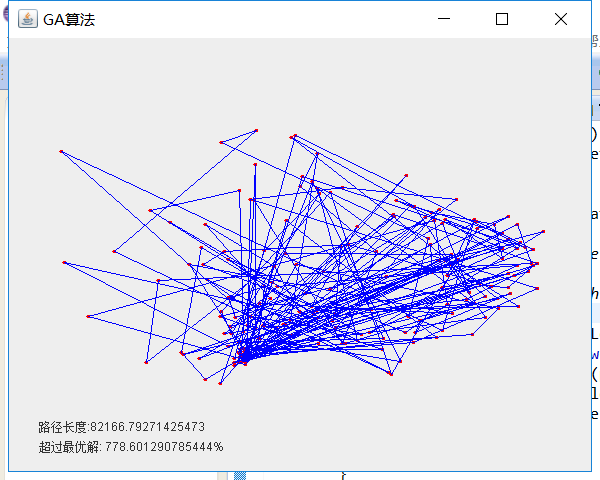
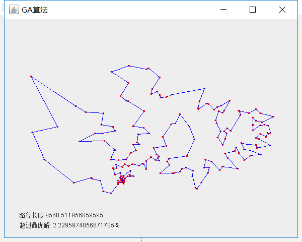

# <center>**GA遗传算法实验报告**</center>

| 课程名称 |     人工智能     |   任课老师   |   王甲海   |
| :------: | :--------------: | :----------: | :--------: |
|   年级   |       大三       | 专业（方向） |    计应    |
|   学号   |     16340015     |     姓名     |   陈彬彬   |
|  Email   | 944131226@qq.com |   完成日期   | 2019/01/14 |

***

## 1. 摘要

该实验通过设计交叉操作，引入多种局部搜索操作替换变异操作，使用遗传算法求解TSP问题（问题规模等和模拟退火求解TSP实验同），求出一个超过100个城市的TSP问题的不超过最优解10%的解。

得到结论：遗传算法跟模拟退火算法比较起来，遗传算法搜索从群体出发，具有潜在的并行性，可以进行多个个体的同时比较，比模拟退火算法更容易跳出局部最优，，更稳定地进入10%的同时效率也比SA算法要高。

***

## 2. 导言

**项目源码** 

[https://github.com/SYSUcarey/AI](https://github.com/SYSUcarey/AI) 

**TSP问题背景介绍** 

TSP问题，假设一个旅行商人要去n个城市，他必须经过且只经过每个城市一次，要求最后回到出发的城市，并且要求他选择的路径是所有路径中的最小值 。TSP问题是一个组合优化问题，该问题如果用穷举的方法解决，解的空间范围是指数级的。迄今为止，这类问题中没有一个找到有效算法，是NP难问题。 

**TSP数据** 

在 [TSPLIB网站](http://comopt.ifi.uni-heidelberg.de/software/TSPLIB95/) 中选一个大于100个城市数的TSP数据。本实验选择的Qatar 国家的194个城市数据，路径长度计算方式使用平面欧几里得距离：

- NAME : qa194
- COMMENT : 194 locations in Qatar
- COMMENT : Derived from National Imagery and Mapping Agency data
- TYPE : TSP
- DIMENSION : 194
- EDGE_WEIGHT_TYPE : EUC_2D

**Genetic Algorithm 遗传算法背景介绍**

遗传算法也是计算机科学人工智能领域中用于解决最优化的一种搜索启发式算法，是进化算法的一种 。

遗传算法是从代表问题可能潜在的解集的一个种群开始的，而一个种群则由经过基因编码的一定数目的个体组成。每个个体实际上是染色体带有特征的实体。

初代种群产生之后，按照适者生存和优胜劣汰的原理，逐代演化产生出越来越好的近似解，在每一代，根据问题域中个体的适应度大小选择个体，并借助于自然遗传学的遗传算子进行组合交叉和变异，产生出代表新的解集的种群。这个过程将导致种群像自然进化一样的后生代种群比前代更加适应于环境，可以作为问题近似最优解。

***

## 3. 实验过程

#### 3.1 算法思想流程

##### **TSP解的表示**  

按照路径序列表示。例如10个城市，序号1,2,3,4,···,10。

如果一个解(List)为：`1,5,6,7,4,9,2,3,8,10`

它表示旅行者先从城市1出发，经过 `1->5->6->7->4->9->2->3->8->10->1` 的路径回到城市1。

##### **GA遗传算法求解过程**  

1. 初始化第一代种群，种群大小N，设置接受代数T、交叉概率、变异概率等参数
2. 对每M代的种群，如果M达到了接受代数T，那么结束。否则使用基于排名的轮盘赌策略选择交配池(保留10%的精英个体)。
3. 对交配池，使用OX交叉策略生成2N个子代(保留10%的精英个体)，贪心选择前N个子代作为下一代种群个体。
4. 对交叉操作得到的N个个体进行变异判断(保留最精英一个个体不变异)，然后依照变异概率决定个体是否变异，从三种变异策略(同SA模拟退火算法中的三种邻域操作)中选择一种进行个体变异。
5. 当前经过选择、交叉、变异后的种群作为下一代种群，跳到步骤2。

#### 3.2 程序主要流程

##### **代码结构** 

```
./TSP
├── Qatar.txt # TSP城市数据 
│
├── src # 源码
│   ├── algorithm # 算法实现包
│   │   ├── City.java  # 单个城市数据封装类
│   │   ├── LS.java # LS局部搜索算法实现类(另一个实验)
│   │   ├── SA.java # SA模拟退火算法实现类(另一个实验)
│   │   ├── GA.java # GA遗传算法实现类
│   │   ├── Individual.java # GA算法中种群个体封装类
│   │   └── Tools.java # 工具类
│   │
│   └── ui # 可视化UI包
│       ├── MainUI.java # 人工智能实验TSP相关问题求解主UI
│       └── TSPUI.java # TSP可视UI帧界面
│    
└── docs # 文档
   ├── SA-Design.md # 模拟退火SA算法实验报告(另一个实验)
   └── GA-Design.md # 遗传算法GA算法实验报告
```

##### **GA算法(核心代码实现)**  

- 定义GA算法中的参数

```java
private List<City> datas;	// 城市数据
private int cityNum;	// 城市数目
private int N = 200;		// 种群大小
private List<Individual> group;		// 种群
private int[] bestPath;				// 当前最优路径
private double bestPathLen;			// 最优个体的路径长度
private double bestFitness; 		// 最优个体的适应值
private int T = 2400; 			// 接受代数
private double Pcross = 1;		// 交叉概率
private double Pmutation = 0.1;	// 变异概率
private List<Individual> new_group;	// 下一代种群
private int L = 0;			// 代数统计

// 最优解长度
public double answer = 9352;

double p;			//概率p
boolean isFinished = false;		// 搜索完成标志

// 基于排名的转盘赌选择
double a = 1.1;		//参数a		
double b = 0.2;		//参数b
double[] proList;	//个体选中概率区间
```

- `void evolution()`

  种群演绎进化函数：对于每一代种群进行选择、交叉、变异操作，生成下一代种群。当达到接受代数时，结束搜索。

```java
// 遗传算法演绎进化过程
public void evolution() {
    List<Individual> temp = group;
    while(++L < T) {
        select();
        cross();
        mutation();
        Collections.sort(group);
        double len = group.get(0).len;
        if(len < bestPathLen) {
            bestPath = group.get(0).path;
            bestPathLen = group.get(0).len;
            bestFitness = group.get(0).fitness;
        }
    }
    isFinished = true;
    // TODO: 输出显示部分
    // ...
}
```

- `void select() ` 

  选择操作函数：保留10%的优良精英，其余90%使用基于排名的轮盘赌选择策略生成交配池。

```java
/*---------选择: 保留10%优良个体的轮盘赌选择法---------*/
public void select() {
    new_group.clear();
    Individual individual;
    // 保留10%的精英个体
    for(int i = 0; i < N/10; i++) {
        individual = group.get(i).clone();
        new_group.add(individual);
    }
    // 其余90%依照排名的轮盘赌进行选择
    while(new_group.size() < N) {
        p = new Random().nextDouble();
        for(int j = 0; j < N; j++) {
            if(p <= proList[j]) {
                individual = group.get(j).clone();
                new_group.add(individual);
                break;
            }
        }
    }
    Collections.sort(new_group);
}
```

​		基于排名的线性轮盘赌：

​		选中第i个个体的轮盘概率为：`pi=(a-b*i/(N+1))/N` 

- `void cross()`

  交叉操作：保留10%优良个体的OX交叉策略

```java
/*------交叉操作: 保留10%优良个体的OX交叉 ------*/
public void cross() {
    // 选择后的交配池new_group进行交叉操作到group
    group.clear();
    // 保留10%的优良解到子代
    for(int i = 0; i < N/10; i++) {
        group.add(new_group.get(i).clone());
    }
    // 总共生成共2N个子代
    while(group.size() < 2*N) {
        p = new Random().nextDouble();
        int n = N;
        int s1 = new Random().nextInt(n);
        int s2 = new Random().nextInt(n);
        while(s2 == s1) s2 = new Random().nextInt(n);
        int temp = Math.max(s1, s2);
        s1 = Math.min(s1,s2);
        s2 = temp;
        int[] path1 = new_group.get(s1).path;
        int[] path2 = new_group.get(s2).path;
        if(p < Pcross) {
            int p1 = new Random().nextInt(cityNum);
            int p2 = new Random().nextInt(cityNum);
            while(p2 == p1) p2 = new Random().nextInt(cityNum);
            int min = Math.min(p1, p2);
            int max = Math.max(p1, p2);
            int[] childPath = ox(path1, path2, min, max);
            int[] childPath2 = ox(path2, path1, min, max);
            double len1 = getPathLen(childPath, datas);
            double len2 = getPathLen(childPath2, datas);
            Individual ind = new Individual(childPath, len1, answer/len1);
            Individual ind2 = new Individual(childPath2, len2, answer/len2);
            group.add(ind);
            group.add(ind2);
        }
    }
    // 淘汰末尾N个劣解子代(贪心选择)
    Collections.sort(group);
    for(int i = N; i < group.size(); i++) {
        group.remove(i);
    }
}
```

- `int[] ox(int[] path1, int[] path2, int min, int max)`

  选择操作中对于一对个体中进行OX交叉操作生成一个子代。

  OX操作即Order Crossover两点顺序交换交叉操作：

  - 第一步随机选择一对染色体（父代）中几个基因的起止位置（两染色体被选位置相同）。

     

  - 第二步，生成一个子代，并保证子代中被选中的基因的位置与父代相同。

     

  - 第三步（可再分两小步），先找出第一步选中的基因在另一个父代中的位置，再将其余基因按顺序放入上一步生成的子代中。

     

```java
// OX Order Crossover两点顺序交换交叉操作
private int[] ox(int[] path1, int[] path2, int min, int max) {
    int[] res = new int[cityNum];
    int index = 0;
    for(int i = 0; i < cityNum; i++) {
        if(i >= min && i <= max) {
            res[i] = path1[i];
            continue;
        }
        for(int j = index; j < cityNum; j++) {
            boolean isConflict = false;
            for(int k = min; k <= max; k++) {
                if(path1[k] == path2[j]) {
                    isConflict = true;
                    break;
                }
            }
            index++;
            if(isConflict) {
                continue;
            }
            else {
                res[i] = path2[j];
                break;
            }
        }
    }
    return res;
}
```

- `void mutation()` 

  保留最优一个个体不变异。如果种群中已经有重复个体，后面重复的个体一定变异。

  同SA算法一样，采用三种邻域操作替换成这里的变异操作：`swap`、`reverse`、`rightShift`。 

  

```java
/*------ 变异操作：保留最优不变异，并保证新种群无重复个体(维持多样性)的三种领域变异------*/
public void mutation() {
    double preLen = 0;
    double Len = 0;
    // 三种策略变异
    // 保留最优解不变异
    for(int i = 1; i < N; i++) {
        p = new Random().nextDouble();
        Len = group.get(i).len;
        if(p < Pmutation || Len == preLen) {
            int type = new Random().nextInt(3);
            int p1 = new Random().nextInt(cityNum);
            int p2 = new Random().nextInt(cityNum);
            int[] path = group.get(i).path;
            switch(type) {
                case 0:
                    Tools.swap(path, p1, p2);
                case 1:
                    Tools.reverse(path, p1, p2);
                case 2:
                    Tools.rightShift(path, p1, p2);
            }
            double len = getPathLen(path, datas);
            double fitness = answer / len;
            group.get(i).setPath(path);
            group.get(i).setLen(len);
            group.get(i).setFitness(fitness);
        }
        preLen = Len;
    }
}
```

***

## 4. 结果分析

#### 4.1 实验环境

> 编程语言：Java
>
> 运行环境：Windows 10
>
> IDE：Eclipse
>
> 直接运行MainUI.Java即可

#### 4.2 结果

(根据 [TSPLIB网站](http://comopt.ifi.uni-heidelberg.de/software/TSPLIB95/) 中给出的Qatar TSP数据的最优解长度为9352)

运行 `MainUI.java` 


运行GA遗传算法求解TSP：





路径：

```
81->84->83->88->92->97->95->96->93->91->103->102->109->113->114->119->122->118->106->105->107->108->100->110->112->115->116->117->121->120->123->124->128->133->135->129->131->136->143->148->160->155->151->158->159->162->166->171->185->170->167->165->168->178->180->193->181->177->184->188->189->191->192->190->187->183->175->173->174->172->179->186->194->182->176->169->161->163->164->157->154->150->153->152->147->141->144->139->138->142->146->149->156->145->140->137->134->132->126->125->127->130->111->104->101->99->94->89->90->98->86->85->65->20->63->36->59->62->82->71->80->87->76->75->78->72->74->69->60->33->18->21->24->26->17->7->11->14->25->23->13->16->8->6->1->4->2->3->5->9->10->12->15->19->30->32->31->35->42->50->55->49->44->38->41->46->48->54->52->53->56->58->61->67->73->66->68->51->47->43->40->34->39->37->27->22->29->28->45->57->64->70->77->79
```

依次执行结果表格：（分别执行10次）

|      | GA    | SA    |
| ---- | ----- | ----- |
| 1    | 2.22% | 5.80% |
| 2    | 7.26% | 8.11% |
| 3    | 7.72% | 5.60% |
| 4    | 5.38% | 5.63% |
| 5    | 4.76% | 6.12% |
| 6    | 6.51% | 9.16% |
| 7    | 7.11% | 7.98% |
| 8    | 8.28% | 6.85% |
| 9    | 4.96% | 5.70% |
| 10   | 4.14% | 6.16% |


统计表格：

|          | GA    | SA    |
| -------- | ----- | ----- |
| 最好解   | 2.22% | 5.60% |
| 最差解   | 8.28% | 9.16% |
| 平均值   | 5.83% | 6.69% |
| 平均时长 | 95s   | 50s   |
|          |       |       |

#### **4.3结论**

1. GA遗传算法跟模拟退火算法进行效率的比较，本质其实是多点搜索和单点搜索的比较。遗传算法搜索从群体出发，具有潜在的并行性，可以进行多个个体的同时比较，比模拟退火算法更容易跳出局部最优，，更稳定地进入10%的同时效率也比SA算法要高一点点。在实验中，GA算法的效率在4%-9%之内，甚至有一次跑到了2.22%，而SA算法的效率在5%-10%。
2. 在用时上，GA遗传算法确实要比SA用时更多。在早期，SA会在解空间不断震荡，而GA直接就会很快地降下来，误差很快缩小。在后期，GA算法中，种群会不断在最优值附近变化，但可能是因为交叉算子没有设计得很好，在后期并没有很明显地缩小误差，也没有特别逼近最优解9352（看到别的组有的误差在1%以内觉得很厉害）。用时还有一个比较久的问题可能是初始解没有进行贪心选择，即初始种群不够优秀。
3. 遗传算法效率相比模拟退火算法其实也没有太大的改进，实际上基本的遗传算法是有很多不足的，如容易陷入局部收敛，容易早熟，全局搜索能力还不够强等。

***

## 5. 参考文献

[维基百科](https://www.wikipedia.org/)

[CSDN：遗传算法中几种交叉算子小结](https://blog.csdn.net/u012750702/article/details/54563515/) 

[CSDN：基于遗传算法求解TSP问题（JAVA）](https://blog.csdn.net/u012750702/article/details/54563515/)  