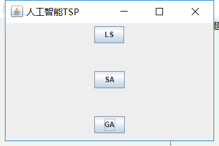
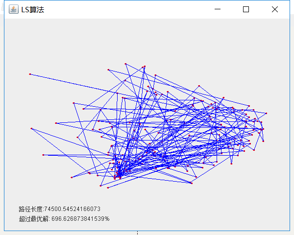
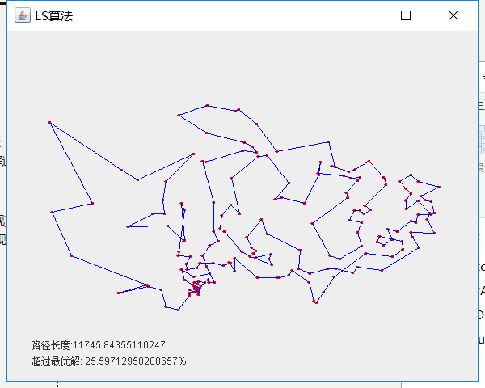
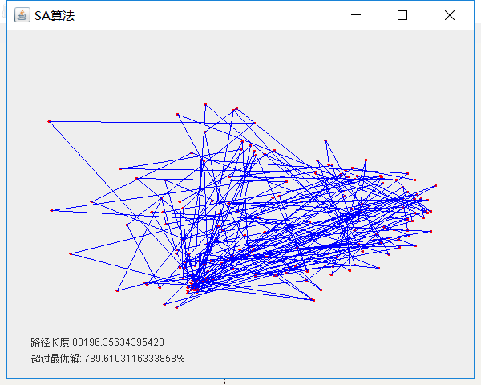
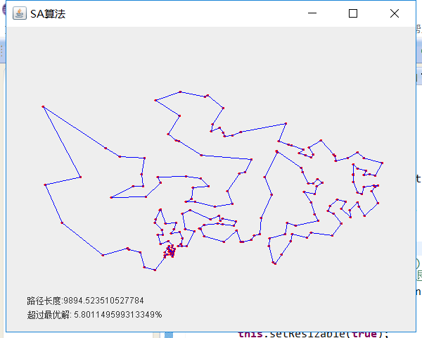

# <center>**模拟退火SA算法实验报告**</center>

| 课程名称 |     人工智能     |   任课老师   |   王甲海   |
| :------: | :--------------: | :----------: | :--------: |
|   年级   |       大三       | 专业（方向） |    计应    |
|   学号   |     16340015     |     姓名     |   陈彬彬   |
|  Email   | 944131226@qq.com |   完成日期   | 2019/01/13 |

***

## 1. 摘要

该实验使用多种邻域操作的局部搜索local search策略，以及在这个局部搜索策略上使用模拟退火simulated annealing策略进行优化，求出一个超过100个城市的TSP问题的不超过最优值10%的解。

得到的结论是：SA优化的方法主要通过设置多个邻域操作获取新解以及设置适当的初温、末温、降温速度等的参数，使所得解进入不超过最优解10%以内的范围。SA优化的效果是使得TSP路径交叉程度大幅度减少，路径长度也更小更优。

***

## 2. 导言

**项目源码** 

[https://github.com/SYSUcarey/AI](https://github.com/SYSUcarey/AI) 

**TSP问题背景介绍** 

TSP问题，假设一个旅行商人要去n个城市，他必须经过且只经过每个城市一次，要求最后回到出发的城市，并且要求他选择的路径是所有路径中的最小值 。TSP问题是一个组合优化问题，该问题如果用穷举的方法解决，解的空间范围是指数级的。迄今为止，这类问题中没有一个找到有效算法，是NP难问题。 

**TSP数据** 

在 [TSPLIB网站](http://comopt.ifi.uni-heidelberg.de/software/TSPLIB95/) 中选一个大于100个城市数的TSP数据。本实验选择的Qatar 国家的194个城市数据，路径长度计算方式使用平面欧几里得距离：

- NAME : qa194
- COMMENT : 194 locations in Qatar
- COMMENT : Derived from National Imagery and Mapping Agency data
- TYPE : TSP
- DIMENSION : 194
- EDGE_WEIGHT_TYPE : EUC_2D

**Local Search 局部搜索背景介绍**

在计算机科学中，**局部搜索**是解决最优化问题的一种元启发式算法。局部搜索从一个初始解出发，然后搜索解的邻域，如有更优的解则移动至该解并继续执行搜索，否则返回当前解。

局部搜索的优点是简单、灵活及易于实现，缺点是容易陷入局部最优且解的质量与初始解和邻域的结构密切相关。 

**Simulated Annealing 模拟退火算法背景介绍**

**模拟退火**是一种通用概率算法，常用来在一定时间内寻找在一个很大搜寻空间中的近似最优解。 与物理上金属退火的原理相似，算法先以搜寻空间内一个任意点作起始：每一步先选择一个“邻居”，然后再计算从现有位置到达“邻居”的概率 。

在每个温度下进行一轮的迭代过程，它是模拟退火算法的核心步骤，分为新解的产生和接受新解两部分：

1. 由一个产生函数从当前解产生一个位于解空间的新解；为
2. 计算与新解所对应的目标函数差。
3. 判断新解是否被接受，判断的依据是一个接受准则：若Δt′<0则接受S′作为新的当前解S，否则以概率`1/(1+exp(-Δt′/T))`接受S′作为新的当前解S。
4. 当新解被确定接受时，用新解代替当前解。

模拟退火算法与初始值无关，算法求得的解与初始解状态S（算法迭代的起点）无关；模拟退火算法具有渐近收敛性，已在理论上被证明是一种以概率1收敛于全局最优解的全局优化算法；

***

## 3. 实验过程

#### 3.1 算法思想流程

##### **TSP解的表示**  

按照路径序列表示。例如10个城市，序号1,2,3,4,···,10。

如果一个解(List)为：`1,5,6,7,4,9,2,3,8,10`

它表示旅行者先从城市1出发，经过 `1->5->6->7->4->9->2->3->8->10->1` 的路径回到城市1。

##### **LS局部搜索求解过程** 

1. 初始化一个随机解。
2. 根据当前解生成一个邻居解集。(3种领域操作)
3. 若邻居解集中没有比当前解更好的，结束。若有，使用第一适应，将当前解设置成邻居解集中第一个更优解。回到步骤2。

##### **SA模拟退火算法求解过程** 

1. 初始化初始温度T0、接受温度T_end、降温速度q、迭代次数L等参数
2. 初始化一个随机解。
3. 在当前温度T下进行一轮L次的迭代过程。每次迭代根据当前解生成一个邻居解，若该邻居解比当前解更优，直接接受该解，将当前解设置当这个邻居解；若不然，那么根据概率 `1/(1+exp(-df/T))` 接受该解。
4. L次的迭代过程后，进行降温`T=T*q`，如果温度T小于接受温度T_end，那么结束；若不然，回到步骤3。

#### 3.2 程序主要流程

##### **代码结构** 

```
./TSP
├── Qatar.txt # TSP城市数据 
│
├── src # 源码
│   ├── algorithm # 算法实现包
│   │   ├── City.java  # 单个城市数据封装类
│   │   ├── LS.java # LS局部搜索算法实现类
│   │   ├── SA.java # SA模拟退火算法实现类
│   │   ├── GA.java # GA遗传算法实现类(另一个实验)
│   │   ├── Individual.java # GA算法中种群个体封装类
│   │   └── Tools.java # 工具类
│   │
│   └── ui # 可视化UI包
│       ├── MainUI.java # 人工智能实验TSP相关问题求解主UI
│       └── TSPUI.java # TSP可视UI帧界面
│    
└── docs # 文档
   ├── SA-Design.md # 模拟退火SA算法实验报告
   └── GA-Design.md # 遗传算法GA算法实验报告
```

##### **LS算法(核心代码实现)**  

- `void search()`

  实现LS局部搜索过程：

```java
//局部搜索
public void search() {
    boolean searchEnd = false;
    while(!searchEnd) {
        double old_len = getPathLen(path, datas);
        double new_len;
        t++;
        // 根据不同的邻居选择策略进行搜索
        List<int[]> neighbors = getNeighbor(path);
        // 采用第一适应,碰到第一个更优解就选择
        int index;
        for(index = 0; index < neighbors.size(); index++) {
            new_len = getPathLen(neighbors.get(index), datas);
            if(new_len < old_len) {
                path = neighbors.get(index);
                break;
            }
        }
        // 无更优解,即进入局部最优值,结束搜索
        if(index == neighbors.size()) searchEnd = true;
    }
    isFinished = true;
    showPath(path);
}
```

- `List<int[]> getNeighbor(int[] path_) ` 

  根据当前解生成邻居解集，邻居解集设置size为1000，随机使用三种邻域操作。

```java
// 根据当前解生成邻居解集即新的可能解集
public List<int[]> getNeighbor(int[] path_) {
    List<int[]> res = new ArrayList<>();
    while(res.size() < 1000) {
        int type = new Random().nextInt(3);
        int[] newPath = createNewPath(path_, type);
        if(!res.contains(newPath)) res.add(newPath);
    }
    return res;	
}
```

- `int[] createNewPath(int[] old_path, int type)`

  使用三种邻域操作产生邻居解：

  - **swap** 

    将解(List)的随机两个位置p1,p2（zero-based）的值调换，即替换两个城市的访问顺序。

    例如:

    `p1=2, p2=5`

    `old_path={1,5,6,7,4,9,2,3,8,10}`

    那么：

    `new_path={1,5,9,7,4,6,2,3,8,10}` 

  - **reverse** 

    将解(List)的随机两个位置p1,p2中间访问的城市顺序倒序。

    例如:

    `p1=2, p2=5`

    `old_path={1,5,6,7,4,9,2,3,8,10}`

    那么：

    `new_path={1,5,9,4,7,6,2,3,8,10}`  

  - **rightShift** 

    将解(List)的随机两个位置p1,p2中间的访问城市，按顺序循环右移一位。

    例如:

    `p1=2, p2=5`

    `old_path={1,5,6,7,4,9,2,3,8,10}`

    那么：

    `new_path={1,5,9,6,7,4,2,3,8,10}`  

```java
// LS.java
// 根据当前解产生新的解
// 多种邻域操作随机
public int[] createNewPath(int[] old_path, int type) {
    int[] res = old_path.clone();
    int p1 = new Random().nextInt(old_path.length);
    int p2 = new Random().nextInt(old_path.length);
    switch(type) {
        case 0:
            Tools.swap(res, p1, p2);
            return res;
        case 1:
            Tools.reverse(res, p1, p2);
            return res;
        case 2:
            Tools.rightShift(res, p1, p2);
            return res;
    }
    return res;
}
```

```java
// Tools.java
// 交叉策略1: 交换数组元素
public static boolean swap(int[] path, int p1, int p2) {
    if(p1 >= path.length || p2 >= path.length || p1 < 0 || p2 < 0) return false;
    int temp = path[p2];
    path[p2] = path[p1];
    path[p1] = temp;
    return true;
}
// 交叉策略2: 倒序片段
public static boolean reverse(int[] path, int p1, int p2) {
    if(p1 >= path.length || p2 >= path.length || p1 < 0 || p2 < 0 || p1 == p2) return false;
    int u = p1, v = p2;
    if(p1 > p2) {
        u = p2;
        v = p1;
    }
    for(int i = u, j = v; i < j; i++, j--) {
        int temp = path[j];
        path[j] = path[i];
        path[i] = temp;
    }
    return true;
}
// 交叉策略3: 片段循环右移一位
public static boolean rightShift(int[] path, int p1, int p2) {
    if(p1 >= path.length || p2 >= path.length || p1 < 0 || p2 < 0 || p1 == p2) return false;
    int u = p1, v = p2;
    if(p1 > p2) {
        u = p2;
        v = p1;
    }
    int temp = path[v];
    for(int i = v; i > u; i--) {
        path[i] = path[i-1];
    }
    path[u] = temp;
    return true;
}
```

##### **SA算法(核心代码实现)** 

- 定义SA算法中的参数

```java
// SA算法中定义的参数
private double T0 = 10000;	// 初始温度
private double T_end = 1;	// 结束温度
private double q = 0.96;	// 降温系数
private int L = 500;		// 每个温度迭代次数，也即链长
private volatile int[] path;	// 当前的最佳路径
private double T;			// 当前温度	
private int count = 0;		// 降温次数
private boolean isFinished;	// 是否结束SA搜索
```

- `void initPath()`

  生成初始解：随机一个解序列，设置为当前初始解

```java
// 随机序列生成初始解
public void initPath() {
    path = Tools.create_random_permutation(datas.size());
}
```

- `void search()`

  SA搜索过程:

  - 随着温度下降，增大降温系数，使得降温速度更慢，在最后的趋于收敛的过程中慢降温，提高找到更优的解的概率。
  - 每次迭代过程中，三种邻域操作随机生成一个邻居解，根据新解和当前解的比较，确定新解与当前解的能量变化df(这里是路径长度的差值)。若该邻居解比当前解更优，直接接受该解，将当前解设置当这个邻居解；若不然，那么根据概率 `1/(1+exp(-df/T))` 接受该解。

```java
public void search() {
    int type, k;
    double old_len, new_len, df, r, p;
    while(T > T_end) {
        if(T>100) {
            q = 0.96;
        }
        else if(T>20) {
            q = 0.98;
        }
        else {
            q = 0.995;
        }

        for(int i = 0; i < L; i++) {
            type = new Random().nextInt(3);
            int[] newPath = createNewPath(path, type);
            old_len = getPathLen(path, datas);
            new_len = getPathLen(newPath, datas);
            df = (new_len - old_len);
            if(df <= 0) {
                path = newPath;
            }
            else {
                r = new Random().nextDouble();
                p = 1/(1+Math.exp(-df/T));
                if(r > p) {
                    path = newPath;
                }
            }
        }
        T *= q;
        count++;
    }
    isFinished = true;
    // TODO: 输出显示部分
    // ...
}
```

- `int[] createNewPath(int[] old_path, int type)`

  产生新解：实现方法跟LS算法中一样，相同的三种邻域操作。

***

## 4. 结果分析

#### 4.1 实验环境

> 编程语言：Java
>
> 运行环境：Windows 10
>
> IDE：Eclipse
>
> 直接运行MainUI.Java即可

#### 4.2 结果

(根据 [TSPLIB网站](http://comopt.ifi.uni-heidelberg.de/software/TSPLIB95/) 中给出的Qatar TSP数据的最优解长度为9352)

运行 `MainUI.java` 




运行LS局部搜索算法求解：






路径：

```
154->157->153->150->144->141->152->147->151->136->131->122->139->138->146->149->142->137->125->127->126->119->113->109->114->104->101->82->87->80->76->75->78->88->92->108->107->105->106->97->95->96->93->91->102->103->118->117->121->129->135->143->148->160->185->180->178->193->188->189->183->175->173->174->179->172->169->176->182->194->186->187->190->192->191->184->181->177->168->165->167->162->158->159->170->171->166->155->133->128->124->123->120->116->115->112->110->100->83->84->79->81->77->70->57->45->29->28->33->18->21->25->23->26->24->17->7->11->14->13->16->36->8->6->1->4->2->3->9->5->10->12->15->19->30->32->35->31->42->44->49->50->55->54->48->52->53->56->43->46->41->38->40->47->58->61->51->39->34->27->22->37->68->66->67->73->64->60->69->74->72->71->59->62->89->99->94->90->63->20->65->85->86->98->111->130->134->132->140->145->156->161->163->164
```


运行SA模拟退火算法求解：





路径：

```
163->164->169->176->182->194->190->187->183->186->179->172->174->173->175->177->181->184->189->192->191->188->193->185->180->178->170->171->167->168->165->159->158->162->166->160->148->143->135->133->128->124->123->120->121->129->131->136->155->151->147->141->152->153->157->154->150->144->139->138->125->126->119->122->118->117->116->115->112->110->107->108->100->84->81->79->83->92->97->105->106->96->95->93->88->74->69->70->77->73->67->61->66->68->64->45->57->60->33->26->24->21->18->28->29->22->27->37->51->47->58->56->48->52->53->54->55->49->50->42->44->46->41->38->43->40->39->34->31->35->32->30->19->15->12->10->9->5->3->2->4->1->6->8->16->13->14->11->7->17->25->23->71->80->87->76->75->72->78->91->103->102->109->113->114->82->62->59->36->63->20->65->85->86->98->90->89->94->99->101->104->111->130->127->132->134->140->137->142->146->149->145->156->161
```


依次执行结果表格：（分别执行10次）

|      | LS     | SA    |
| ---- | ------ | ----- |
| 1    | 25.59% | 5.80% |
| 2    | 46.71% | 8.11% |
| 3    | 43.62% | 5.60% |
| 4    | 37.39% | 5.63% |
| 5    | 32.36% | 6.12% |
| 6    | 35.51% | 9.16% |
| 7    | 31.72% | 7.98% |
| 8    | 29.39% | 6.85% |
| 9    | 35.08% | 5.70% |
| 10   | 39.60% | 6.16% |


统计表格：

|          | LS     | SA    |
| -------- | ------ | ----- |
| 最好解   | 25.59% | 5.60% |
| 最差解   | 46.71% | 9.16% |
| 平均值   | 36.38% | 6.69% |
| 平均时长 | 12s    | 50s   |
|          |        |       |

#### **4.3结论**

1. SA模拟退火是LS局部搜索的一种优化，避免轻易地陷入局部最优，减小了与最优解的误差。
   - LS算法计算出来的最优路与实际最优解的误差大致在30%-50%之间，而SA算法计算出来的最优路与实际最优解的误差大致在5%-10%之间。
   - 说明LS算法容易陷入局部最优，实际最优解误差较大，且通过可视化可以看到，LS算法求出的解依然存在较大的交叉程度。
   - 而SA添加了接受差解的概率，可以有概率跳出局部最优，因此最后计算出来的最优路误差保证在了10%以内，且没有了路径交叉。
2. LS局部搜索很快就进入了收敛，从初始解混乱的路径迅速减少路径的交叉程度，路径长度迅速接近最优解，但最后也因为陷入局部最优无法跳出的原因，仍然存在部分路径交叉，误差也较大。而SA模拟退火优化后，在算法搜索早期，由于温度高接受差解的概率大，解在解空间内不停振荡，交叉程度依然如初始解般混乱，解路径长度不断振荡，等过了一段时间后，路径长度开始迅速地减小，交叉程度也逐渐减小，到最后误差控制在10%以内，图中基本没有路径交叉。
3. 一种提高算法搜索效率，避免更快进入局部最优的方法是：多种邻域操作替代单一邻域操作。
   - 当使用一种邻域操作时(swap)，LS算法求解误差在100%-150%之间，SA算法求解误差在50%-70%之间
   - 当使用三种邻域操作时(swap+reverse+rightShift)，LS算法求解误差在30%-50%，而SA算法求解误差在5%-10%之间
   - 这说明，如果只用单一一种邻域操作，求解效率将差很多，但SA依然是LS的改进，依然比LS要好。而使用多种邻域操作，求解效率优化很大，SA的求解误差能稳定控制在10%以内。
4. 另外一种提高它们搜索效率的方法是增加迭代次数，两种算法的效率都能实现更高。LS算法将迭代次数翻倍，求解误差将优化到10%-25%左右，偶尔能跑进10%。SA算法将迭代次数翻倍，求解误差将优化到3%-8%左右，提升效率不明显。但相应的程序运行时长相应也明显增加。

***

## 5. 参考文献

[维基百科](https://www.wikipedia.org/)

[CSDN：模拟退火算法解决TSP问题](https://blog.csdn.net/qq_34062105/article/details/80468038)

[博客园：模拟退火算法（SA）求解TSP 问题（C语言实现）](http://www.cnblogs.com/lyrichu/p/6688459.html) 